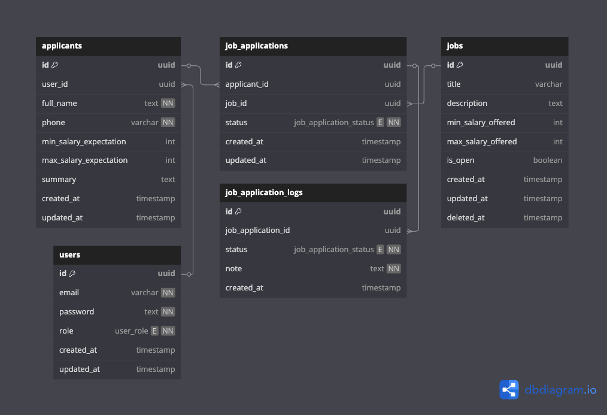

<h1 align="center">👜 JOBS SEEKER</h1>

Simply application <b><u>Jobs Seeker</u></b> dashboard management and user experience friendly

---

## 🚀 Features

<ol>
    <li>
        
✅ User Authentication (Next-Auth)

    </li>
    <li>
        
👤 Roles (Admin & Applicant)

        <ul>
            <li>
Dashboard Admin (Management and Listing Jobs)
</li>
            <li>
Dashboard Applicant (View own jobs)
</li>
        </ul>
    </li>
    <li>
🔔 Jobs Application Logs
</li>
</ol>

---

## 🏃 How to run

- Clone this repository
- Copy `.env.example` to `.env.local`
- Make sure you already have a database connection to Neon Postgres and a properly configured connection string
- Good Luck Have Fun 💗

---

## 🔗 Link

- Production (Soon) 🚀
